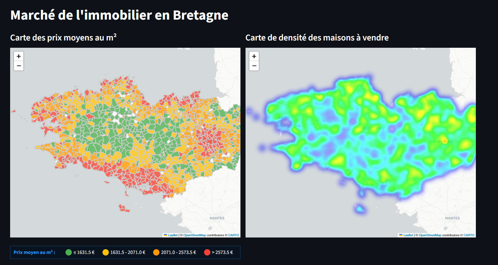

# Projet Immobilier Bretagne

Ce projet analyse le marché immobilier des maisons en Bretagne à partir de données scrapées.

## Aperçu

## Fonctionnalités

- **Scraping** : Collecte des annonces immobilières depuis des sites web.
- **Nettoyage des données** : Suppression des doublons, erreurs de codes postaux, et filtrage des annonces non pertinentes (fermes, rénovations).
- **Analyse statistique** : Histogrammes, violin plots, scatter plots des prix au m².
- **Cartes interactives** : Carte choroplèthe des prix moyens et heatmap de densité des maisons.
- **Application web** : Interface Streamlit pour recherche avancée, statistiques, et estimation de prix par KNN.

## Structure des données

- `STEP00/` : Communes par département.
- `STEP01/` à `STEP04/` : Données scrapées et nettoyées.
- `STEP05/` : Agrégation par commune.
- `STEP06/` : Ajout des coordonnées GPS.
- `STEP07/` : Création des cartes.

## Installation

1. Cloner le repo.
2. Créer un environnement virtuel : `python -m venv venv`
3. Activer : `venv\Scripts\activate` (Windows)
4. Installer les dépendances : `pip install -r requirements.txt`

## Utilisation

- Lancer l'app : `streamlit run app.py`

## Technologies

- Python, Pandas, Geopandas, Folium, Seaborn, Streamlit, Scikit-learn
